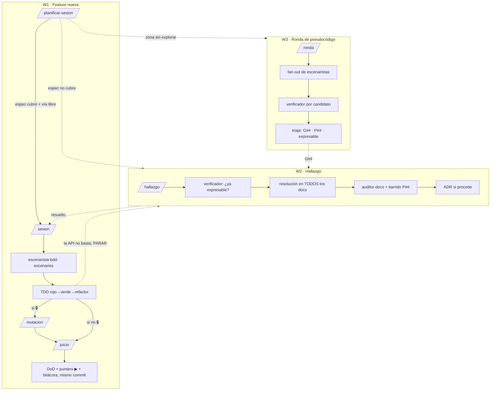

# El mapa: agentes, skills y flujos de trabajo

Meta-tooling de asistentes para desarrollar `nu`. No es parte de la espec del
proyecto (eso vive en `docs/`): es la mecanización del flujo que `CLAUDE.md` y
`docs/implementacion.md` ya exigen — SDD (los documentos son el proyecto), BDD
(escenarios antes que código), TDD (rojo→verde→refactor), jueces clean-room y
mutation testing como juez mecánico.

## Situación → invoca

| Si... | Entonces |
|---|---|
| Quiero una feature nueva | `/planificar-sesion` (la puerta SDD: sin espec no hay sesión) |
| Hay una sesión abierta (puntero ▶ ≠ `—`) | `/sesion` |
| La API no me basta / un contrato presupone API inexistente / apareció una grieta | `/hallazgo` |
| Quiero torturar una zona de la API antes de congelar un diseño | `/ronda` |
| Voy a cerrar una sesión 🔒 o un diff que toca API/contratos | `/mutacion` + `/juicio` (en ese orden, y siempre antes de bitácora/puntero) |
| Cerré una fase (checkpoint 🔎) o toca endurecimiento periódico | `/mutacion` sobre los paquetes 🔒 + `/juicio` si algo cambió + `auditor-docs` global |
| Toca la pasada periódica de salud (semanal/quincenal, o hace mucho de la última) | `/salud` (fuzzing con corpus acumulativo, estrés `-race`, govulncheck, rotación de mutación) |
| La web de docs derivó de `api.md` (job "Coherencia web ↔ api.md" en rojo) o una sesión/hallazgo tocó firmas | `/sync-web` (el detector `web/scripts/check-drift.mjs` señala; la skill redacta y verifica) |
| Doy de alta (o retiro) una página de la wiki de la web: nueva guía, página de extensión, o un contrato de `docs/` que pasa a publicarse | `/alta-wiki` (la checklist mecánica de puntos de contacto: docmap ↔ WIKI_SLUGS ↔ i18n + cierre en verde) |

## Los cuatro flujos y cómo se encadenan

**W4 · Endurecimiento de fase** (sin skill propia): checkpoint 🔎 del plan →
`/mutacion` sobre los paquetes 🔒 de la fase → los LIVED alimentan a
`juez-tests` → tests nuevos → `auditor-docs` en pasada global.

**W5 · Salud del repo** (`/salud`, periódico): la capa mecánica — fuzzing de
las dianas de `internal/runtime/fuzz_test.go` (corpus acumulativo), estrés del
race detector (`-count=10 -shuffle=on`), `govulncheck` pineado y una rotación
de `/mutacion`. Detectores que no alucinan, para lo que cambia aunque el
código no cambie; cierra con fila en `skills/salud/bitacora.md`. En su primer
uso cazó un bug real en 🔒 S22 (palabra de anchura 0 borrada por `wrapText`) y
3 CVEs de la stdlib alcanzables.

## Quién invoca a quién

| Agente | Lo lanza | Papel |
|---|---|---|
| `escenarista-bdd` | `/sesion` (modo sesión), `/ronda` (modo ronda, en paralelo) | Escenarios Dado/Cuando/Entonces desde la espec |
| `juez-espec` | `/juicio`, workflow `revision-limpia` | Refutar conformidad diff↔espec |
| `juez-tests` | `/juicio`, workflow `revision-limpia` | Refutar que la suite muerde |
| `juez-concurrencia` | `/juicio`, workflow `revision-limpia` | Carreras, cancelación, LIFO, foto-vs-vivo |
| `juez-filosofia` | `/planificar-sesion`, `/hallazgo` | Las 6 ideas centrales + ADRs, solo diseño |
| `verificador` | `/juicio`, `/ronda`, `/hallazgo` (uno POR hallazgo) | Matar falsos positivos |
| `auditor-docs` | `/hallazgo`, W4 | Coherencia cruzada de docs/ + disparadores P## |

Los jueces y el verificador **solo** se lanzan desde sus skills con la
plantilla de prompt literal de `juicio/SKILL.md` — nunca a mano con contexto
improvisado: el prompt improvisado filtra la justificación del autor.

## Las reglas de no-contaminación (resumen)

1. Los jueces arrancan **sin contexto de la conversación** (subagentes
   frescos, nunca forks).
2. Reciben **solo artefactos públicos**: diff verbatim + §N de espec +
   enunciado S##. Jamás razonamiento del autor, alternativas discutidas ni
   bitácora.
3. Su frontmatter `tools: Read, Grep, Glob` — **sin Bash** (ni `git log` ni
   mensajes de commit: el razonamiento histórico contamina) y **sin
   Edit/Write** (juzgan, no arreglan). ⚠️ **Esta lista es la garantía técnica
   del clean-room: añadirles Bash "para que puedan compilar" rompe el
   aislamiento silenciosamente.** Si un juez necesita el resultado de un
   build/test, se lo pasa el orquestador como dato.
4. El juicio va **antes** de escribir bitácora/puntero.
5. Mandatos **asimétricos**: el juez refuta el código; el verificador refuta
   al juez. Hallazgo sin cita textual de espec = descartado. Un verificador
   fresco por hallazgo vale más que un panel de 3 votando (los votos comparten
   sesgos; la asimetría no).

## Política de coste (cuándo montar el panel)

Sesión 🔒, o diff que toca `api.md`/contratos/scheduler → panel completo (3
jueces; puede delegarse en el workflow `revision-limpia`). Lógica propia
normal → `juez-espec` + `juez-tests`. Wrapper fino → solo `juez-espec`. Glue,
docs o render visual → ninguno (basta el DoD). La tabla existe para no
saltarse el juicio "porque es caro" justo cuando importa.

## Mutation testing

Binario externo pineado: `go install
github.com/go-gremlins/gremlins/cmd/gremlins@v0.6.0`. **Nunca en `go.mod`,
nunca sobre `internal/vmwasm`, nunca como gate de CI** (razones en
`skills/mutacion/SKILL.md`). Siempre `--dry-run` primero y
`--timeout-coefficient 300` (la caché de `go test` falsea la línea base y sin
él todo sale TIMED OUT). Piloto 2026-07 sobre `internal/runtime/diff.go`
(🔒 S25): 95 mutantes, 90 KILLED, 5 LIVED en ~4 min — 2 equivalentes de borde
y hallazgos reales de suite (desempate del LCS, formato de `rangeStr`).
