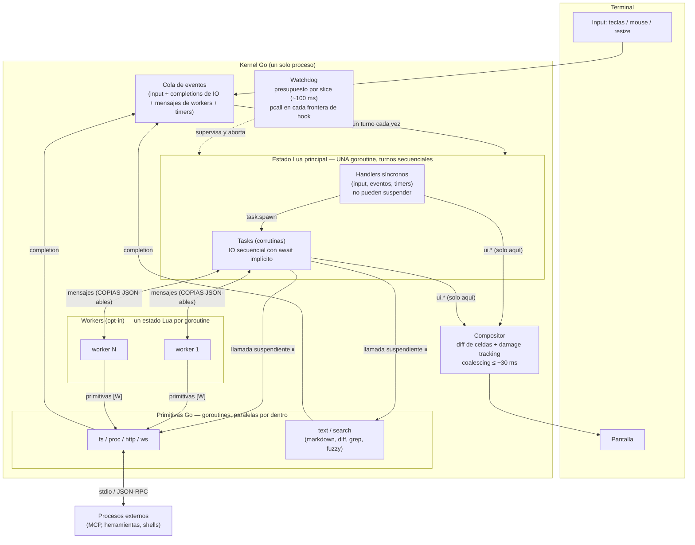
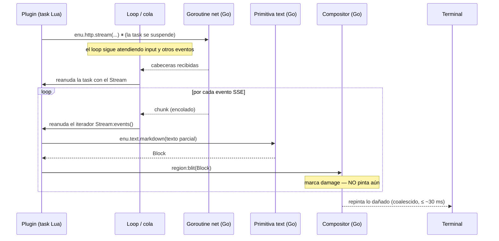

# Modelo de ejecución: comunicación y orquestación

Vista dinámica del sistema: cómo fluyen eventos, IO y pintado entre el estado
Lua principal, las goroutines de Go y los workers. La vista estática está en
[arquitectura.md](arquitectura.md); las firmas, en [api.md](../contracts/api.md).

## Topología

Lectura clave: **todo lo que toca el estado Lua principal pasa por la cola y
se procesa por turnos, de uno en uno**. El paralelismo real vive en las
primitivas Go y en los workers; sus resultados vuelven a la cola como un
evento más. La pantalla tiene un único escritor (el estado principal) y un
único pintor (el compositor).

## Secuencia: el caso caliente (streaming de tokens del LLM)

El plugin escribe código secuencial; la concurrencia (red, render, pintado,
input simultáneo) es invisible para él. Lua solo ejecuta los pasos baratos:
recibir el chunk ya parseado, pedir el Block, colocarlo.

## Limitaciones del modelo (aceptadas y conocidas)

1. **Un turno cada vez en el estado principal.** La latencia de input está
   acotada por el peor slice de Lua en cola. El watchdog corta un slice que
   exceda su presupuesto, pero no protege de la *muerte por mil cortes*
   (muchos handlers lentos pero bajo presupuesto) — ADR-008.
2. **La cancelación es cooperativa.** `Task:cancel()` solo surte efecto en el
   siguiente punto de suspensión. Un bucle de CPU puro en Lua no es
   cancelable: solo el watchdog lo aborta. El aborto no es capturable con
   `pcall`; los recursos se liberan con `enu.task.cleanup` (api.md §1.3).
   Además, cancelar **no interrumpe la primitiva ⏸ en vuelo**: la task ve
   `ECANCELED` al instante, pero la operación Go en curso (`fs.write`,
   `http.request`…) corre hasta su fin natural y sus efectos pueden aterrizar
   después del cleanup ([P33](../postponed/pospuesto.md)).
3. **La frontera de workers solo cruza datos, nunca referencias.** Mensajes =
   valores JSON-ables copiados. No cruzan: closures, userdata ni **Blocks**.
   Consecuencia práctica: un worker no puede pre-renderizar UI; manda datos
   digeridos y el estado principal pide los Blocks y los coloca.
4. **Workers sin `enu.ui` ni `enu.events`.** Su único canal con el mundo es la
   mensajería con el padre. Diseño deliberado (un solo escritor de UI), pero
   significa que un worker no puede reaccionar a eventos del bus ni emitirlos
   directamente. La API del worker puede recortarse aún más al crearlo
   (`opts.caps`), hasta dejar solo los módulos concedidos.
5. **En headless el bombeo retorna en la quiescencia de primer plano** (`Boot`
   y los `Eval` de `-e`/`-p`): mientras ningún bucle bombea, los timers de
   fondo (`enu.task.every`) no laten — se **pausan** (su petición en vuelo
   sigue su curso y el resultado espera) y el siguiente drenaje los reanuda.
   En el modo interactivo el bombeo es **continuo** ([G44](../findings/g44-el-scheduler-no-se-bombea.md),
   resuelta y construida 2026-07-13): `PumpTasks` vive junto al bucle del
   driver — el estado del bombeo está en la `Instance`, un *kick* desde
   `Eval`/`EmitEvent`/`FeedInput` despierta el `select`, y `inst.mu` es el
   único token de entrada a la VM — así que los `every` laten sin pausa y las
   tasks de un keymap o handler corren de inmediato.
6. **Memoria compartida dentro del estado principal.** Un memory leak de un
   plugin infla el proceso entero; no hay presupuesto de memoria por plugin
   en v1 (los actores aislados quedaron como evolución futura, ADR-008).
7. **Repintado coalescido a ~30 ms.** Suficiente para streaming y UI fluida;
   inadecuado para animaciones de alta frecuencia. Decisión consciente: una
   TUI pinta por cambios, no por frames.
8. **Backpressure por ritmo de consumo.** Los streams (SSE, stdout de
   procesos) se bufferizan en Go mientras Lua consume a su ritmo; el buffer
   tiene límite y al excederlo el stream falla (`EIO`). Un consumidor Lua
   lento no puede dejar el buffer creciendo sin cota.
9. **El rendimiento de Lua es el techo del camino caliente.** Todo lo que
   escale con el tamaño de la pantalla o del repo debe ser primitiva Go
   ("Lua decide, Go ejecuta"). Si una extensión necesita CPU en Lua, su
   herramienta es un worker — nunca el estado principal.
