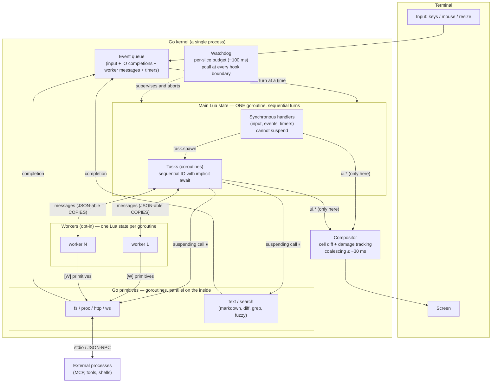
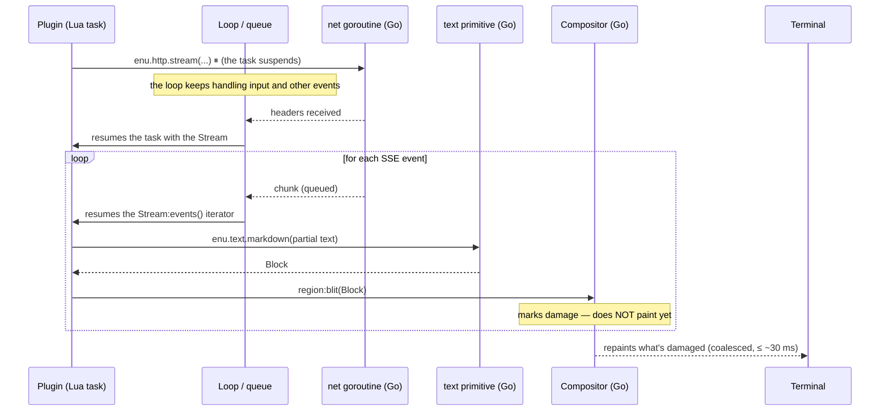

# Execution model: communication and orchestration

Dynamic view of the system: how events, IO, and painting flow between the
main Lua state, Go's goroutines, and workers. The static view is in
[arquitectura.md](arquitectura.md); the signatures are in [api.md](api.md).

## Topology

Key reading: **everything that touches the main Lua state goes through the
queue and is processed turn by turn, one at a time**. The real parallelism
lives in the Go primitives and in the workers; their results come back to
the queue as just another event. The screen has a single writer (the main
state) and a single painter (the compositor).

## Sequence: the hot path (LLM token streaming)

The plugin writes sequential code; the concurrency (network, rendering,
painting, simultaneous input) is invisible to it. Lua only executes the
cheap steps: receiving the already-parsed chunk, requesting the Block,
placing it.

## Limitations of the model (accepted and known)

1. **One turn at a time in the main state.** Input latency is bounded by the
   worst Lua slice in the queue. The watchdog cuts off a slice that exceeds
   its budget, but doesn't protect against *death by a thousand cuts*
   (many slow-but-under-budget handlers) — ADR-008.
2. **Cancellation is cooperative.** `Task:cancel()` only takes effect at the
   next suspension point. A pure CPU loop in Lua is not cancelable: only the
   watchdog aborts it. The abort is not catchable with `pcall`; resources
   are released with `enu.task.cleanup` (api.md §1.3). Moreover, canceling
   **does not interrupt the in-flight ⏸ primitive**: the task sees
   `ECANCELED` instantly, but the Go operation in progress (`fs.write`,
   `http.request`…) runs to its natural end and its effects may land after
   the cleanup ([P33](../postponed/pospuesto.md)).
3. **The worker boundary only crosses data, never references.** Messages =
   copied JSON-able values. What doesn't cross: closures, userdata, or
   **Blocks**. Practical consequence: a worker can't pre-render UI; it sends
   digested data and the main state requests the Blocks and places them.
4. **Workers have no `enu.ui` or `enu.events`.** Their only channel to the
   world is messaging with the parent. Deliberate design (a single UI
   writer), but it means a worker can't react to bus events or emit them
   directly. The worker's API can be trimmed even further at creation time
   (`opts.caps`), down to only the granted modules.
5. **In headless mode the pump returns at foreground quiescence** (`Boot`
   and the `Eval` calls of `-e`/`-p`): while no loop is pumping, background
   timers (`enu.task.every`) don't tick — they get **paused** (their
   in-flight request keeps running and the result waits) and the next drain
   resumes them. In interactive mode the pumping is **continuous**
   ([G44](../findings/g44-el-scheduler-no-se-bombea.md), resolved and built 2026-07-13): `PumpTasks`
   lives alongside the driver's loop — the pump's state lives in the
   `Instance`, a *kick* from `Eval`/`EmitEvent`/`FeedInput` wakes up the
   `select`, and `inst.mu` is the only entry token into the VM — so the
   `every` timers tick without pausing and the tasks of a keymap or handler
   run immediately.
6. **Shared memory within the main state.** A memory leak in one plugin
   bloats the entire process; there's no per-plugin memory budget in v1
   (isolated actors were left as future evolution, ADR-008).
7. **Repaint coalesced to ~30 ms.** Enough for streaming and fluid UI;
   inadequate for high-frequency animations. Conscious decision: a TUI
   paints on change, not per frame.
8. **Backpressure by consumption rate.** Streams (SSE, process stdout) are
   buffered in Go while Lua consumes at its own pace; the buffer has a
   limit and exceeding it fails the stream (`EIO`). A slow Lua consumer
   can't leave the buffer growing without bound.
9. **Lua's performance is the ceiling of the hot path.** Everything that
   scales with the size of the screen or the repo must be a Go primitive
   ("Lua decides, Go executes"). If an extension needs CPU in Lua, its tool
   is a worker — never the main state.
